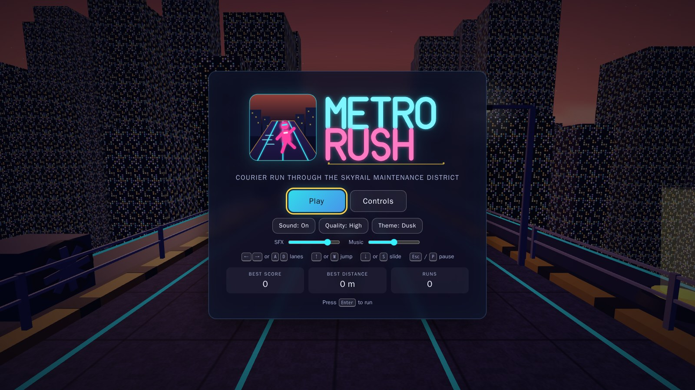
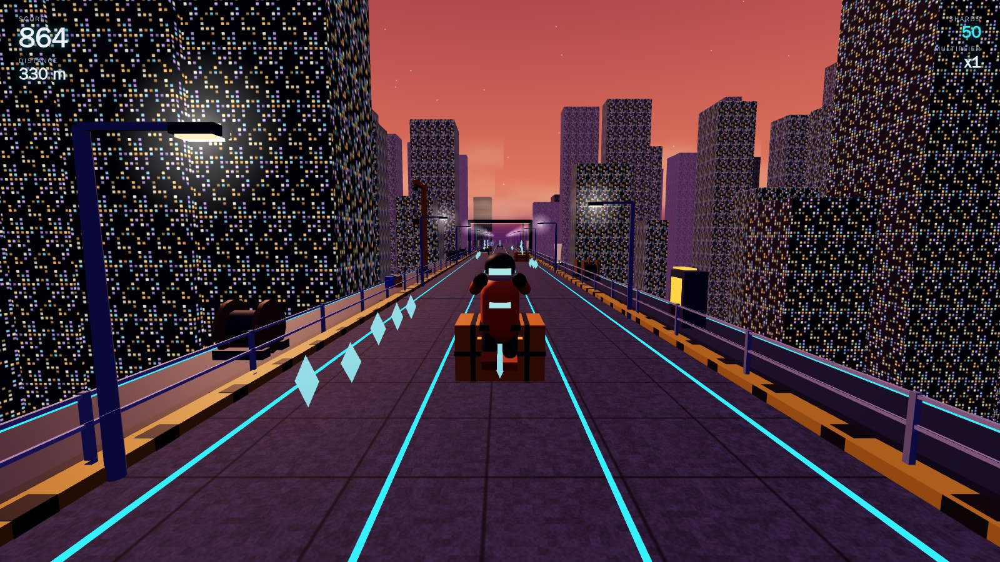

# Metro Rush

Browser endless runner in TypeScript and Three.js. You play a courier sprinting along an elevated skyrail maintenance corridor above a neon city: three lanes (the code reads `CONFIG.lanes.count` everywhere, but the pattern catalogue is written for three), jump the crates, slide under the pipes, get out of the way of the trams, grab energy shards and power-ups. It runs on the keyboard alone, has no backend and downloads no assets. Every mesh, texture and sound is generated in code when the page loads.





More in [screenshots/](screenshots/): overhead obstacles, blockers, power-up chips, the pause and game-over screens, the Midnight and Ember themes, and the debug overlay.

## Running it

```bash
npm install
npm run dev        # http://localhost:5173
npm run build      # production build in dist/
npm run preview    # serve the production build
```

You need Node 18 or newer to build and a browser with WebGL to play. The automated checks (see below) ran in headless Chromium; any current desktop browser should work.

## Controls

| Action | Arrows | WASD |
| --- | --- | --- |
| Move left | Left | A |
| Move right | Right | D |
| Jump | Up | W |
| Slide (mid-air: slam down, then slide on landing) | Down | S |
| Pause / resume | Esc or P | |
| Restart after a run | Enter or R | |

Enter also starts a run from the main menu. Arrow keys do not scroll the page while the game has focus. Presses are buffered for 160 ms, so a jump pressed slightly before landing still fires, and a slow frame cannot eat a press.

Lane changes chain (two presses, two lanes) and a jump can start during a lane change. Pressing slide while already sliding does nothing. Jumping while sliding cancels the slide.

## What's in the world

Ground obstacles you jump: cargo crate, broken rail panel, low equipment cart. Safety cones are clutter; running through them costs a stumble and a few points, nothing more. Stacked crates and a closed maintenance gate block the lane outright.

Overhead obstacles you slide under: a low hanging sign, a service pipe across all lanes, a swinging mechanical arm, a two-lane construction bar.

Lane blockers: a parked cargo tram, an incoming rail car, a barricade wall over two lanes, a construction container.

Three of the hazards move. The incoming rail car sounds its horn, drives toward you in its lane and brakes. The maintenance drone sweeps sideways between lanes at head height; slide under it. The crossing service cart is low and moves sideways; jump it.

Energy shards come in lines, in arcs over jumps and in low trails under the overhead obstacles. Power-ups: magnet field, barrier shield, score amplifier, sprint boost, auto-hop boots. Each shows as a chip with a timer in the HUD while it lasts.

Score comes from distance, shards and time survived, all multiplied by the current multiplier. The base multiplier goes up one step every 500 m (max 5) and the amplifier doubles it. Passing a fatal hazard by a hair pays a near-miss bonus. Cones cost 40 points. The game-over screen shows score, distance, shards, time survived and near misses next to the stored bests. Best score and best distance are kept in `localStorage`.

The menus have three color themes (Dusk, Midnight, Ember), a low-quality mode, a mute toggle and volume sliders.

## Debug mode

`http://localhost:5173/?debug=true` shows FPS, draw calls, speed, lane, player state, segment count, the current and next pattern id, the RNG seed and generator stats, and draws collision boxes. Other query parameters:

- `?seed=1234` fixes the seed, so the same track comes up every run
- `?colliders=1` draws collision boxes without the rest of the overlay
- `?quality=low` and `?theme=midnight` force settings

With `debug=true`, `console.debug` logs every pattern choice and every validator rejection with the reason. `window.metroRush` is the live `Game` instance.

## Architecture

```
src/
  main.ts                   bootstrap, WebGL error page
  game/
    Game.ts                 state machine (MENU, PLAYING, PAUSED, GAME_OVER), frame loop, wiring
    Config.ts               every tunable number, query-string overrides, quality presets
    InputManager.ts         keyboard mapping, press buffer, scroll prevention
    AudioManager.ts         Web Audio synthesis for all SFX plus a looped sequencer track
    SaveManager.ts          guarded localStorage
    Themes.ts               color palettes
  player/
    PlayerController.ts     lane interpolation, jump/gravity, slide, stumble, crash, grace timers
    PlayerModel.ts          the courier mesh and its animations
    PlayerState.ts
  world/
    WorldManager.ts         lights, fog, backdrop, pools, segment ring
    SegmentManager.ts       scrolls and recycles segments, asks the generator for new plans
    Segment.ts              one 24 m stretch: track mesh + pooled entities
    PatternGenerator.ts     weighted pattern choice + validation loop
    Patterns.ts             the pattern catalogue
    ReachabilityValidator.ts  proves a route exists before a plan is committed
    SegmentPlan.ts          plain-data description of a segment
    TrackBuilder.ts         deck, rails, pillars, lamps (built once, cloned per segment)
    SceneryBuilder.ts       sky dome, stars, clouds, instanced skyline, pooled side props
  entities/
    Entity.ts               base class + AABB type
    Obstacle.ts             placed obstacle, motion (oncoming / lateral), collider
    ObstacleDefinitions.ts  the obstacle catalogue (collider sizes + mesh builders)
    ObstacleFactory.ts      one pool per obstacle type
    Collectible.ts          shards + one InstancedMesh that draws all of them
    PowerUp.ts              pickup entity + pools
    PowerUpDefinitions.ts   the five power-ups (color, duration, icon, pickup mesh)
    PowerUpManager.ts       active effect timers and the queries other systems make
  systems/
    CollisionSystem.ts      swept AABB tests, hit resolution, shard/pickup collection, magnet pull
    ScoreSystem.ts
    DifficultySystem.ts     speed over time, difficulty over distance
    ParticleSystem.ts       one InstancedMesh, typed arrays, no per-frame allocation
    CameraController.ts     chase camera: follow, lean, bob, FOV, shake
  ui/
    UIManager.ts            all DOM work
    styles.css
  utils/
    MeshKit.ts              build a prop from colored primitives, merge to 1-2 meshes
    Textures.ts             canvas-generated textures (deck, windows, signs, clouds, glow)
    Random.ts               seedable PRNG
    ObjectPool.ts, EventBus.ts, MathUtils.ts
```

The player never moves forward. The world scrolls toward +z and the player sits at the origin, which keeps floating point tidy on long runs and means the shadow camera never has to move. Track distance is counted separately in `SegmentManager.totalDistance`.

Systems talk through `Game` and a small typed `EventBus` (`shardCollected`, `crash`, `nearMiss` and so on). Audio, particles, camera shake and HUD text are subscribers. The simulation never touches the DOM or the AudioContext.

### Keyboard input

Everything is in `src/game/InputManager.ts`. `KEYMAP` maps `KeyboardEvent.code` to actions. The `keydown` handler calls `preventDefault()` on arrow keys (except inside form controls, and Space on a focused button) and ignores `repeat` events. Each press is stored with a timestamp and a frame counter. `PlayerController.readInput()` calls `consume(action, buffer)` only when the action is legal: lane changes always, jump only when grounded (so the press waits in the buffer while airborne), slide always (mid-air it turns into a fast-fall with a queued slide). `Game.handleGlobalInput()` handles pause, confirm and restart per state.

### Segment generation

`SegmentManager` keeps `activeSegmentCount` (12) segments in a ring, enough that the far end sits past the fog. When the near edge of the first segment is `recycleBehind` meters past the player, that segment moves to the far end and gets refilled.

Refilling calls `PatternGenerator.generate()` with the segment's start distance, the difficulty (0..1, from that distance) and a speed range around the nominal speed curve at that distance, wide enough to cover stumbles and sprints. Nothing about the live run feeds in, so `?seed=` reproduces the same track whatever the player does.

Segments inside `safeDistance` get the shard-only intro pattern. Otherwise a pattern is picked by weighted random among those whose `minDifficulty` is met. Weights can be functions of difficulty, which is how the moving hazards get more common later in a run. The same pattern never repeats back to back, and after two intense patterns only light ones are considered.

The pattern's `spawn()` writes obstacles, shards and power-ups into a `SegmentPlan`, which is plain data. Lanes are rolled at spawn time, so one pattern reads differently every time.

The plan then goes through `ReachabilityValidator.validate()`. A rejected plan is dropped and another pattern is tried, up to `maxPatternAttempts`, with a breather segment as the last resort. In a 4000-segment stress run across the full difficulty range the last resort never triggered; the debug panel shows the count as `fallbacks`. Only after validation does `Segment.populate()` pull pooled meshes and place them.

The validator walks the previous committed segment and the new one together in 0.5 m steps, so the player may start reacting to the new segment before reaching it and obstacles on both sides of the boundary are seen together. For each lane it keeps one number: the earliest track distance at which a player in that lane could be idle. A required jump or slide needs the player idle `reactionTime` before the obstacle and makes them busy for the action's length. Being idle inside a jump or slide interval means the obstacle would have been hit. A block can never be stayed in. Lane changes take `laneChangeDuration * speed` meters and both lanes have to be clear for the crossing; a chained double change only needs the middle lane clear while it is crossed. Obstacles closer than 2.5 m in one lane merge into one compound, and compounds too deep to clear with one jump or slide become blocks. Reaction and lane-change distances use the top of the speed range, jump coverage uses the bottom, so the check only errs toward rejecting. A plan is accepted only if some route exists and, separately, every lane the player could be in at the boundary has its own way through. Without the second check a plan with a two-lane wall could pass because the third lane survives while a player the previous segment nudged into lane 0 has nowhere to go. An oncoming tram's lane counts as blocked over its whole travel range, and the tram is never allowed to leave that range.

### Collision

Everything in `src/systems/CollisionSystem.ts` is an axis-aligned box. Obstacle colliders come from `ObstacleDefinitions` (`width`, `depth`, `yMin`, `yMax`) and are a little smaller than the visuals on purpose. The player is a box `halfWidth` wide, `halfDepth` deep and `height` tall; sliding drops the height to `slideHeight`, jumping raises the bottom. Overhead colliders start at 1.45 m (slide height is 0.9 m) and jumpable colliders top out at 1.15 m (a jump peaks at 2.25 m). Those margins are what make the slide and jump outcomes predictable.

Along the track the player's box is extended by the distance the world moved this frame, plus the obstacle's own motion for trams, so nothing tunnels at 42 m/s or on a slow frame. Only segments overlapping a window around the player are visited.

Hits are evaluated at the moment the along-track boxes actually overlap, with the player's position interpolated across the frame, so a jump that clears a crate with 2 cm to spare is not judged by where the feet were at the end of the frame. Cones cause a stumble: speed dips to 70% and recovers over 0.6 s, and the score takes a small penalty. Cones are ignored during the one-second grace after any stumble. Feet clipping the top of a jumpable obstacle by less than `clipTolerance` (0.3 m) also count as a stumble rather than a crash. Any other fatal contact breaks the shield if one is active, which gives 1.2 s of full invulnerability, and otherwise ends the run. A fatal obstacle whose box came within `nearMissMargin` sideways or `nearMissVertical` above the feet without touching pays the near-miss bonus once it is behind the player.

Shards use a looser box so they are collected while sliding or while jumping through arcs. With the magnet, shards inside the radius move toward the player each frame and are collected on contact. Auto-hop boots look ahead `leadTime * speed` meters in the player's lane for jumpable obstacles flagged `autoHop` and trigger the jump, unless the player is sliding or an overhead obstacle sits within one jump's reach.

## Adding things

### A new obstacle

Add an entry to `OBSTACLE_DEFS` in `src/entities/ObstacleDefinitions.ts`. `avoid` is one of `jump`, `slide`, `block`, `clutter`. Give it collider dimensions and a `build()` that returns a mesh; the `MeshKit` helper merges colored boxes, cylinders and spheres into two draw calls. Add `animate(obj, time)` if it has moving parts. The pool is created automatically. Then reference the id from a pattern.

### A new pattern

Add it to `PATTERNS` in `src/world/Patterns.ts`. `spawn(ctx)` gets helpers (`obstacle`, `shardLine`, `shardArc`, `shardLow`, `powerUp`, `randomLane`, `otherLanes`) and the RNG. Keep obstacles inside `[depth/2, segmentLength - depth/2]` along the track; the validator rejects anything that sticks out. For moving obstacles pass a `motion` spec (`oncoming` or `lateral`). There is no need to prove the pattern fair by hand; the validator rejects any spawn it cannot route.

### A new power-up

Add an id to `PowerUpId` and an entry to `POWER_UP_DEFS` in `src/entities/PowerUpDefinitions.ts` with a duration, color, SVG icon and pickup mesh. Expose the effect as a query on `PowerUpManager` (like `speedBonus` or `magnetRadius`) and read it where it applies. Add it to the `pickPowerUp()` weights in the generator.

### A new theme

Add a palette to `THEMES` in `src/game/Themes.ts` and its id to `ThemeId` in `Config.ts`. Themes recolor the sky, fog, lights, deck tint, lane strips, clouds and skyline at runtime.

### Tuning

`src/game/Config.ts` has the speed curve (`initialSpeed`, `maxSpeed`, `speedAcceleration`), jump physics, lane spacing and lane count (the track, patterns and validator all read `CONFIG.lanes`), validator margins (`reactionTime`, busy factors), scoring values and power-up durations.

## Performance

Segments, obstacles, power-ups, props, shards and particles are pooled, and the steady-state update loop allocates nothing: the HUD data, the player pose and the active-effect list are reused objects. Shards, particles and the scrolling skyline are one `InstancedMesh` each (the skyline samples its window texture in world space), so a typical frame is around 100 draw calls. Every prop and obstacle is merged into at most two meshes, one lit and one glowing.

There is one shadow-casting directional light with a 2048 shadow map. Its orthographic box is fitted at startup (and on every theme change) to the stretch of track the camera can see, with the box aligned along the track so the resolution goes into a narrow strip. Low quality turns shadows off, lowers the render scale and pixel ratio, drops the speed-line effect, halves the skyline and caps live particles at 250; these can be toggled at runtime because the buffers are always allocated at full size. Frame deltas are capped at 50 ms and the game pauses itself when the tab is hidden.

The checks that ran before release, all in headless Chromium: menu, play, pause, game over, restart and best-score persistence through the real keyboard path; a ten-minute simulated run with an invulnerable player and random input, after which every pool was the same size as at the start and the heap sat around 30 MB; the 4000-segment generator stress mentioned above; and a simple autopilot that read the obstacle list and survived 200 s at 1080p without dying.

## Assets

All geometry is built from primitives in code, textures are drawn on canvases and sounds are synthesized. Names, obstacles and the setting are original.
